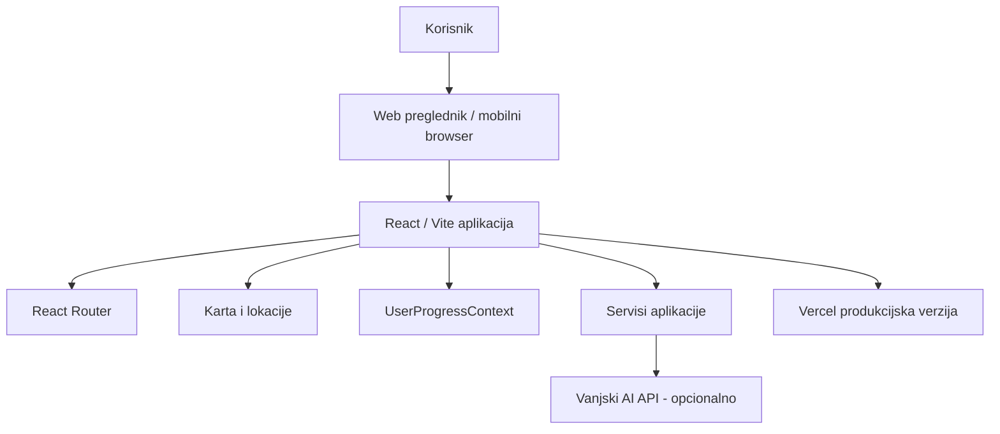

# 02 – Tehnička dokumentacija

## 1. Svrha dokumenta

Ovaj dokument opisuje tehničku izvedbu aplikacije QueueLess. Namijenjen je članovima razvojnog tima, održavateljima aplikacije i nastavniku koji pregledava projekt.

## 2. Tehnologije

Projekt koristi React, Vite, JavaScript, React Router, Leaflet / React Leaflet, React Icons, Google GenAI paket, HTML, CSS, PWA manifest, Vercel, Git i GitHub.

## 3. Arhitektura sustava

Aplikacija je klijentska web aplikacija. Većina logike nalazi se na frontend strani, dok su podaci o lokacijama i korisničkom iskustvu organizirani kroz React komponente, kontekst i servisne datoteke.



## 4. Struktura projekta

```text
queueless/
├── public/
├── src/
├── package.json
├── package-lock.json
├── vite.config.js
├── eslint.config.js
├── index.html
├── README.md
└── projektna-dokumentacija/
```

## 5. Struktura izvornog koda

```text
src/
├── assets/
├── components/
├── context/
├── data/
├── pages/
├── services/
├── App.css
├── App.jsx
├── index.css
└── main.jsx
```

### `components/`
Sadrži višekratno iskoristive React komponente poput navigacije, kartica lokacija, prikaza statusa gužve i pomoćnih layout elemenata.

### `context/`
Sadrži React Context logiku. U projektu se koristi `UserProgressContext`, koji omogućuje dijeljenje korisničkog stanja kroz aplikaciju.

### `data/`
Sadrži demonstracijske ili statičke podatke, npr. lokacije, statuse gužve i podatke potrebne za MVP.

### `pages/`
Sadrži glavne stranice: `Home`, `Explore`, `LocationDetails`, `Community` i `Profile`.

### `services/`
Sadrži servisne funkcije koje izdvajaju poslovnu ili pomoćnu logiku iz komponenti, primjerice obradu procjene čekanja ili komunikaciju s vanjskim API servisima.

## 6. Rute aplikacije

```text
/                  početna stranica
/explore           pregled i istraživanje lokacija
/location/:id      detalji pojedine lokacije
/community         zajednica
/profile           korisnički profil
```

## 7. PWA funkcionalnost

Projekt sadrži `manifest.webmanifest`, kojim se definiraju naziv aplikacije, opis, početni URL, način prikaza, orijentacija, boje teme i ikone. PWA pristup je važan jer je QueueLess zamišljen za korištenje na mobitelu prije ili tijekom odlaska na lokaciju.


## 8. Deploy

Aplikacija je deployana putem Vercela. Vercel omogućuje javni prikaz aplikacije, produkcijski build i konfiguraciju environment varijabli.

## 9. Sigurnost i održavanje

Trenutna verzija ne obrađuje osjetljive osobne podatke korisnika. Ipak, potrebno je ne spremati API ključeve u repozitorij, koristiti environment varijable i u budućem razvoju osigurati validaciju korisničkog unosa.

Kod se održava kroz podjelu na `components`, `pages`, `context`, `data` i `services`. Poslovnu logiku treba izdvajati u servise, a zajedničke UI elemente u komponente.

## 10. Tehnička ograničenja

Trenutni prototip može koristiti demonstracijske podatke. Real-time procjena ovisi o dostupnosti korisničkog inputa, AI funkcionalnosti ovise o API ključu, backend i baza podataka nisu razvijeni kao zasebna produkcijska infrastruktura, a administracijsko sučelje nije implementirano u punoj verziji.

## 11. Zaključak

QueueLess je tehnički izveden kao moderna frontend aplikacija s PWA pristupom i javnim deployem. Struktura projekta omogućuje daljnji razvoj, proširenje funkcionalnosti i buduću integraciju backend sustava, baze podataka i naprednije analitike.
